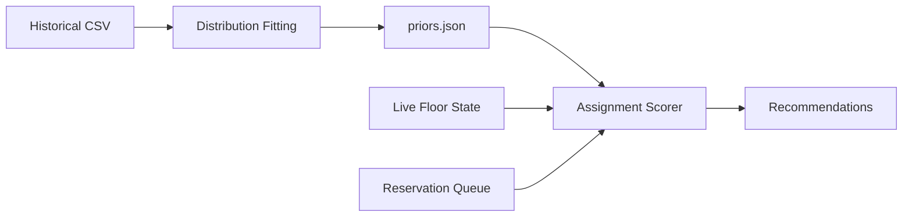

# Table Allocation Optimizer

*Seat the next party where it costs the least future capacity.*

A data-driven table allocation system that maximizes restaurant turnover by analyzing historical patterns and recommending optimal seating assignments in real-time.

## Problem

Restaurants lose revenue when tables are assigned suboptimally:
- A party of 2 seated at a 6-top blocks capacity for later large groups
- Holding a 4-top for a 6pm reservation may reject profitable walk-ins at 5:45pm
- Poor fit decisions compound over a service, reducing total covers per hour

**This tool** estimates expected turnover under uncertainty (walk-in sizes, no-shows, variable meal duration) and recommends which table to assign next.

## Architecture



**Two-layer system:**
1. **Offline**: Ingest historical CSV → learn walk-in size PMFs and dwell-time distributions
2. **Online**: Watch live floor state → recommend next assignment to maximize expected covers

## Quick Start

### Installation

```bash
# Clone and install
git clone https://github.com/yourusername/table-allocation-optimizer.git
cd table-allocation-optimizer
pip install -e .
```

### 1. Fit historical data

```bash
tableopt fit --csv data/examples/sample_history.csv --out artifacts/priors.json
```

This generates probability distributions for:
- Walk-in party sizes by hour/day-of-week
- Dwell times by party size
- No-show rates

### 2. Get seating recommendations

```bash
tableopt recommend --state data/examples/sample_floor_state.json --party-size 4 --priors artifacts/priors.json
```

Output:
```
🎯 Recommendation for party of 4:

Top choice: Table T8 (capacity: 4) — Score: 0.92
  ✓ Perfect fit (no wasted seats)
  ✓ Low opportunity cost: 0.08 (6-tops available for large walk-ins)
  ✓ No reservation conflicts in next 90 minutes

Alternatives:
  2. Table T12 (capacity: 6) — Score: 0.73
     ⚠ Fit penalty: 0.15 (6-top needed for 7pm reservation)
```

### 3. Run live agent

```bash
tableopt agent --priors artifacts/priors.json --state-file data/live/floor_state.json --watch
```

The agent monitors the floor state file and emits recommendations whenever it changes.

## Key Features

- **Data-driven scoring**: Fit penalty + opportunity cost + reservation protection
- **Explainable**: Every recommendation includes score breakdown
- **Flexible**: Works with CSV exports, file watching, or REST API
- **Validated**: Built-in simulator to backtest policies on historical data

## Repository Structure

```
table-allocation-optimizer/
├── src/tableopt/
│   ├── offline/          # Distribution fitting from CSV
│   ├── optimizer/        # Scoring logic and feasibility checks
│   ├── simulator/        # Discrete-event simulation
│   ├── agent/            # Live monitoring and recommendation
│   └── cli.py            # Command-line interface
├── schemas/              # JSON schemas for data validation
├── tests/                # Unit and integration tests
├── data/examples/        # Sample CSV and floor state files
├── docs/                 # Algorithm details and data format
└── config/               # Venue configuration templates
```

## Configuration

Create `config/venue.yaml`:

```yaml
tables:
  - id: T1
    capacity: 2
  - id: T8
    capacity: 4
  - id: T12
    capacity: 6
    combinable_with: [T11]

service:
  dinner_start: "17:00"
  dinner_end: "22:30"

scoring:
  horizon_minutes: 90
  opportunity_cost_weight: 1.0
  reservation_hard_block: true
```

## Data Format

Historical CSV should include:

| Column | Description | Example |
|--------|-------------|---------|
| `date` | Service date | 2024-03-15 |
| `arrival_time` | Party arrival | 18:30:00 |
| `party_size` | Number of guests | 4 |
| `source` | `walk_in` or `reservation` | walk_in |
| `table_id` | Assigned table | T8 |
| `seated_at` | Seating time | 18:35:00 |
| `left_at` | Departure time | 20:10:00 |
| `no_show` | Boolean | false |

See [`docs/data-format.md`](docs/data-format.md) for detailed specifications.

## Algorithm Overview

For each candidate assignment (party → table):

1. **Fit penalty**: Wasted seats weighted by upcoming demand for large tops
2. **Opportunity cost**: P(walk-in arrives) × seats blocked × expected dwell
3. **Reservation protection**: Hard constraint if assignment makes confirmed reservations infeasible
4. **Table combination cost**: Penalty if merging reduces flexibility

**Score = expected_covers_gain - fit_penalty - opportunity_cost - merge_penalty**

Pick argmax; return top 3 with breakdown.

See [`docs/algorithm.md`](docs/algorithm.md) for formulas and worked examples.

## Development

```bash
# Install dev dependencies
pip install -e ".[dev]"

# Run tests
pytest

# Format code
black src/ tests/

# Type check
mypy src/
```

## Roadmap

- [x] Phase 0: Repo skeleton + golden-path test
- [x] Phase 1: CSV fitting pipeline
- [x] Phase 2: Optimizer + CLI
- [x] Phase 3: Live agent
- [ ] Phase 4: Simulator for policy comparison
- [ ] Phase 5: Web dashboard (optional)

## Contributing

See [`CONTRIBUTING.md`](CONTRIBUTING.md) for guidelines on adding:
- POS system CSV adapters
- Custom scoring policies
- New venue types (bars, food courts)

## License

MIT License - see [`LICENSE`](LICENSE)

## Citation

If you use this in research or production, please cite:

```
@software{tableopt2024,
  title={Table Allocation Optimizer},
  author={Chong, Eliott},
  year={2024},
  url={https://github.com/yourusername/table-allocation-optimizer}
}
```
